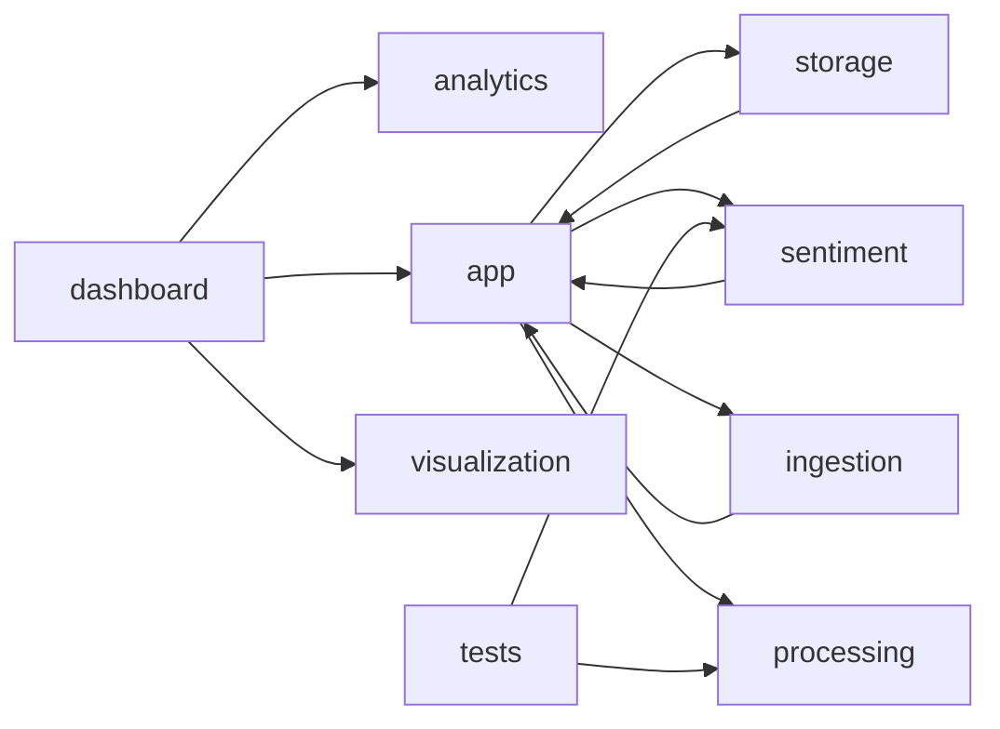
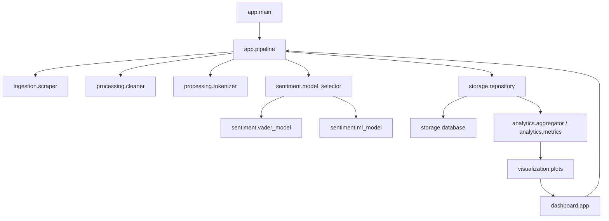

# Project Graph

This graph summarizes the current Python package structure and the main runtime flow in this repository.

## Package Dependency Graph

## Runtime Flow

## Layer Summary

- `app/` wires configuration, schemas, logging, CLI entrypoints, and pipeline orchestration.
- `ingestion/` pulls tweets with retry handling.
- `processing/` cleans and tokenizes tweet text.
- `sentiment/` selects and runs either the VADER or scikit-learn model.
- `storage/` persists runs and tweets in SQLite and serves query results back to the app.
- `analytics/` converts stored results into time series, distributions, and summary metrics.
- `visualization/` builds Plotly charts for the dashboard.
- `dashboard/` provides the Streamlit UI on top of the same pipeline.
